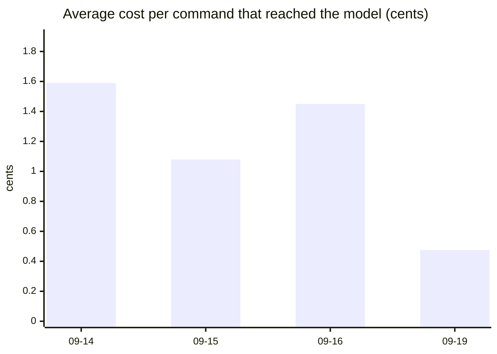

# Measurements

Generated by `sommus stats` on 2026-09-19 from Sommus's own SQLite log and eval results.
Aggregates only — no request text. Includes eval runs, which are most of the early traffic.

## Headline

| | |
|---|---|
| Commands handled | 617 |
| Answered with no model call (fast path) | 36 |
| Total API spend | $7.84 |
| Prompt tokens served from cache (0.1× price) | 89% |
| Tool calls · errors | 815 · 63 (8%) |

## Cost per model-handled command, by day

| Day | Commands | Fast path | Spend | Avg per model command | Cache share |
|---|---|---|---|---|---|
| 2026-09-14 | 381 | 0 | $6.04 | 1.59¢ | 89% |
| 2026-09-15 | 166 | 18 | $1.53 | 1.08¢ | 90% |
| 2026-09-16 | 6 | 2 | $0.04 | 1.45¢ | 73% |
| 2026-09-19 | 64 | 16 | $0.23 | 0.48¢ | 90% |

## Eval runs (tool-call accuracy vs cost)

Each run replays `evals/commands.toml` in fresh conversations; read-only tools run for real,
the rest are simulated. The suite grew from 20 to 46 commands as tools were added.

| When | Model | Effort | Score | Per command | Avg latency |
|---|---|---|---|---|---|
| 2026-09-14 10:56 | Opus 5 | medium | 20/20 | 1.78¢ | 3.7 s |
| 2026-09-14 11:01 | Opus 5 | medium | 20/20 | 0.67¢ | 4.9 s |
| 2026-09-14 11:12 | Opus 5 | medium | 29/31 | 1.87¢ | 5.0 s |
| 2026-09-14 11:16 | Opus 5 | medium | 31/31 | 1.49¢ | 4.3 s |
| 2026-09-14 11:37 | Opus 5 | medium | 37/37 | 2.14¢ | 5.6 s |
| 2026-09-14 11:44 | Sonnet 5 | low | 34/37 | 0.63¢ | 3.7 s |
| 2026-09-14 11:47 | Sonnet 5 | low | 36/37 | 0.66¢ | 3.6 s |
| 2026-09-14 12:04 | Sonnet 5 | low | 36/38 | 0.74¢ | 4.0 s |
| 2026-09-14 12:18 | Sonnet 5 | low | 39/42 | 0.87¢ | 3.9 s |
| 2026-09-14 13:17 | Sonnet 5 | low | 46/46 | 0.95¢ | 4.2 s |
| 2026-09-15 08:53 | Sonnet 5 | low | 37/46 | 0.89¢ | 5.0 s |
| 2026-09-15 08:57 | Sonnet 5 | low | 45/46 | 1.04¢ | 4.9 s |
| 2026-09-19 15:45 | Haiku 4.5 | — | 41/46 | 0.26¢ | 1.8 s |

Design decisions behind these numbers: [docs/decisions](decisions/).
